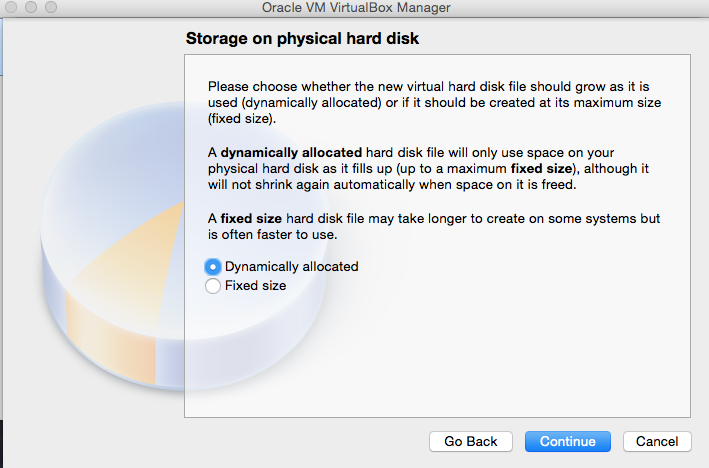
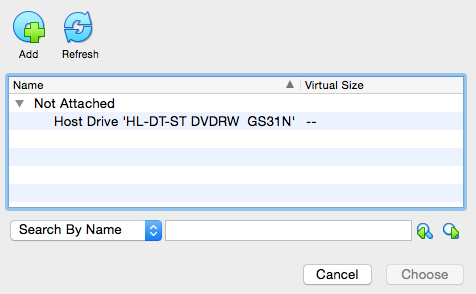

Installing Fedora using VirtualBox
=====================================

Mac OSX
~~~~~~~
..
   Created: Fri, March 8, 2019
   Author: Clint Savage <herlo@socallinuxexpo.org>
           Trevor Sharpe <tsharpe@gmail.com>

This document covers how to install VirtualBox on Mac OSX. Which in turn, is used to install Fedora as a virtual machine.

Obtaining VirtualBox Player
~~~~~~~~~~~~~~~~~~~~~~~~~~~

Obtain a USB from a proctor labeled ISOS, and copy everything to your computer.

The VirtualBox-6.0.4-128413-OSX.dmg should specifically be copied, along with any ISOs.

Alternative Downloads
---------------------

Download VirtualBox-6.0.4-128413-OSX.dmg at

http://192.168.0.254/cblr/ISOs/VirtualBox-6.0.4-128413-OSX.dmg

If all else fails, download the VirtualBox Player at

https://download.virtualbox.org/virtualbox/6.0.4/VirtualBox-6.0.4-128413-OSX.dmg

Installing VirtualBox
~~~~~~~~~~~~~~~~~~~~~

Locate and double-click on the downloaded file. It should launch the installer.

follow the prompts as given below:

Launch VirtualBox
~~~~~~~~~~~~~~~~~

Find VirtualBox and double-click the icon.

The VirtualBox main screen should be displayed.

Create a New Virtual Machine (VM)
~~~~~~~~~~~~~~~~~~~~~~~~~~~~~~~~~

Select 'New' from the main screen and fill in the blanks.

Create a virtual disk for the operating system.

Create a large enough hard drive (20GB is safe)

A VM should successfully be created at this point.

The VM needs a CD attached. Choose `Settings`.

Choose `Storage`, then `Controller: SATA`. Click the CD and plus icon.

Choose the Add button along the top.

Select the Fedora installation ISO file.

.. note:: Use `Fedora-Workstation-Live-x86_64-29-1.2.iso` from the provided labeled `ISOS` or `ISOS NTFS`.

Start the Virtual Machine (VM)
~~~~~~~~~~~~~~~~~~~~~~~~~~~~~~

Select `Start` from the Main Menu with the appropriate VM selected.

Upon boot, a menu will appear prompting for a selection.

Select `Test this media & Start ...`

After booting, the Fedora Desktop should appear with options to 'Try Fedora' or 'Install to Hard Drive'.

Select 'Install to Hard Drive'

.. include:: install.rst

.. include:: bootintofedora.rst
