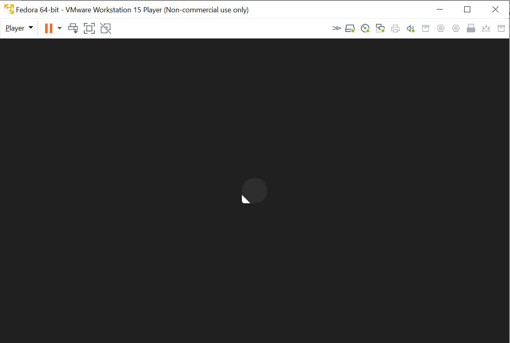
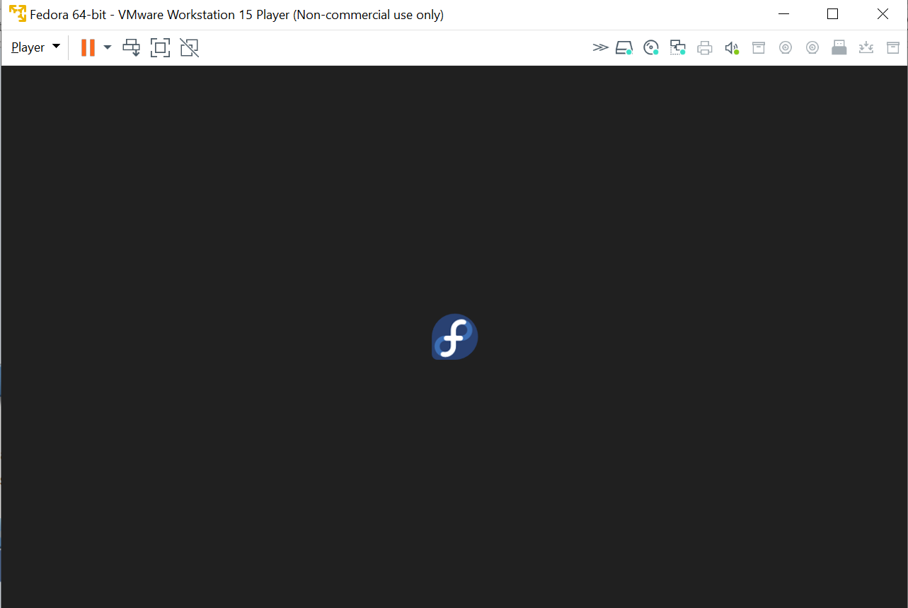
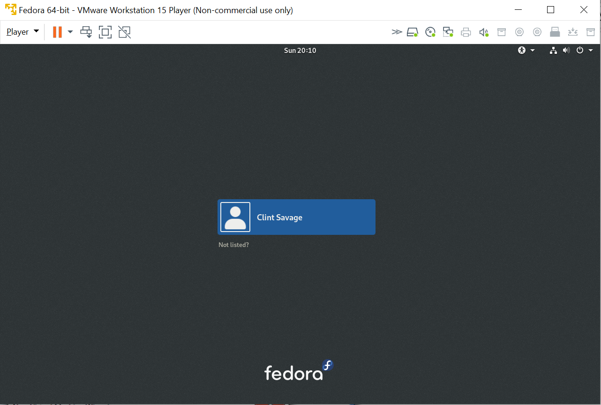
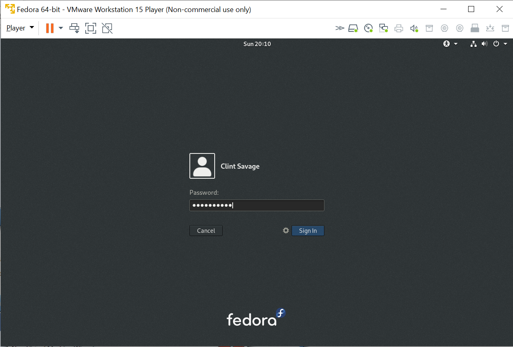
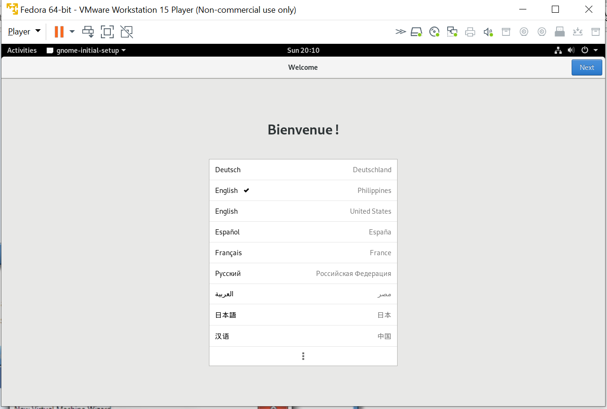
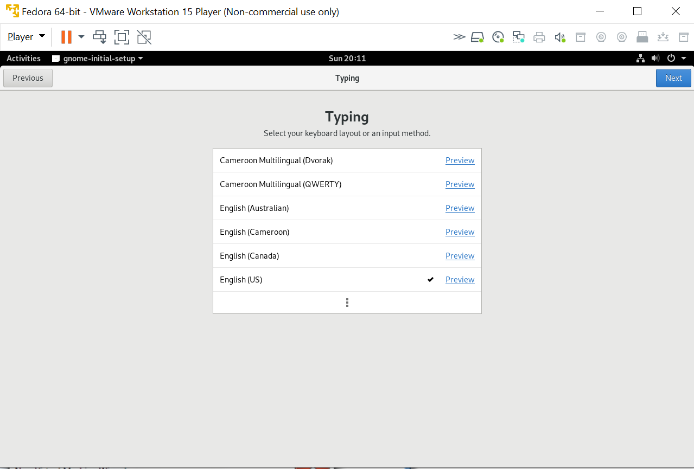
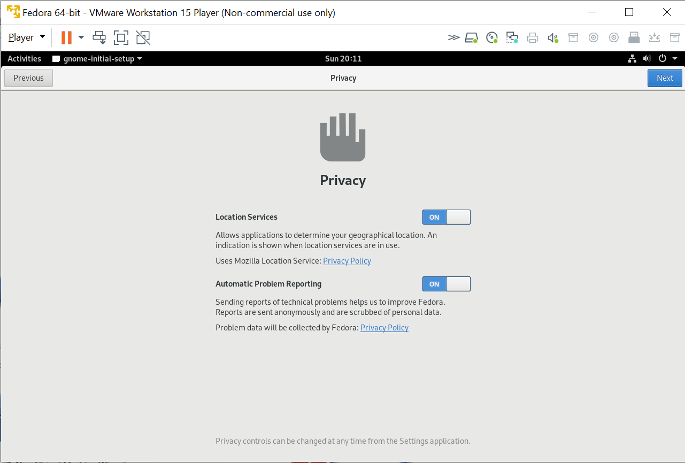
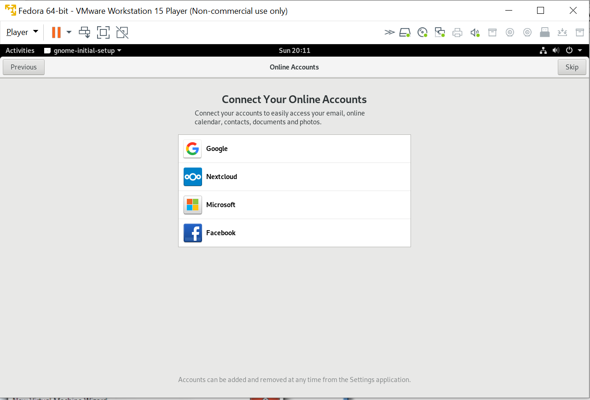
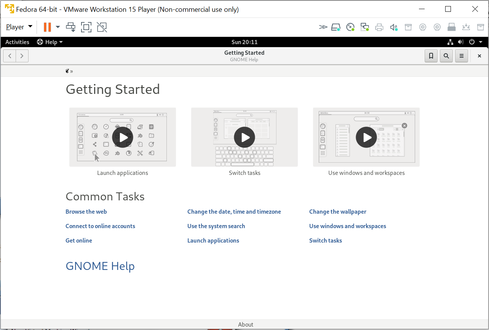
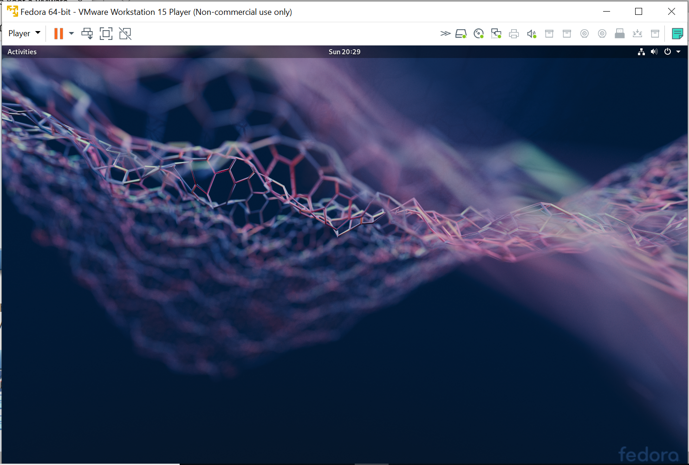

Booting into Fedora
~~~~~~~~~~~~~~~~~~~

After rebooting, the VM should come up and boot directly into Fedora.

The user created during installation should appear on the login screen. 

Select the user and enter the password you recorded above.

Upon successful login, a welcome screen appears.

There are a few setup pages.

.. image:: bootfedora/38-f29-r2g.png

There are a series of helpful starting pages. Review them at your leisure.

Welcome to Fedora, click 'Activities' in the top right corner to get started.

