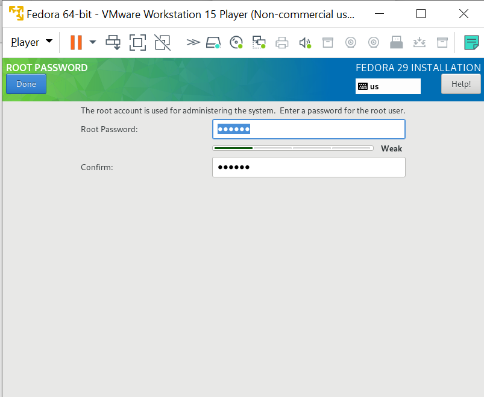

From the GUI installer menu, select the language options you prefer. Choose `Continue` when ready.

.. image:: install/22-installer-language.png
   :scale: 85 %

After a short while, the Installation Source and Software Selection should be downloaded. 

.. note:: This is a network based install, so it may take a moment longer than expected.

Choose `Installation Destination` and ensure the 20GB disk `VMWare Virtual` disk is selected.

.. image:: install/24-install-disk.png
   :scale: 85 %

Once all of the items are resolved, click `Begin Installation`.

.. image:: install/25-begin-install.png
   :scale: 85 %

As the installation progresses, one can set the root password, and create a user.

.. image:: install/26-install-progress.png
   :scale: 85 %

Selecting `User Creation` will allow you to create an unprivileged user.

.. note:: _________________ / ___________________

          Write down the username and password for this user.
          It is useful to select `Make this user and administrator`.

Selecting `Root Password` will allow you to set the root user's password.

.. note:: The 'root' user is the administrator user on Linux systems.

When the installation has completed, the `Reboot` button will appear blue. Click to reboot into the new operating system you've just installed!

