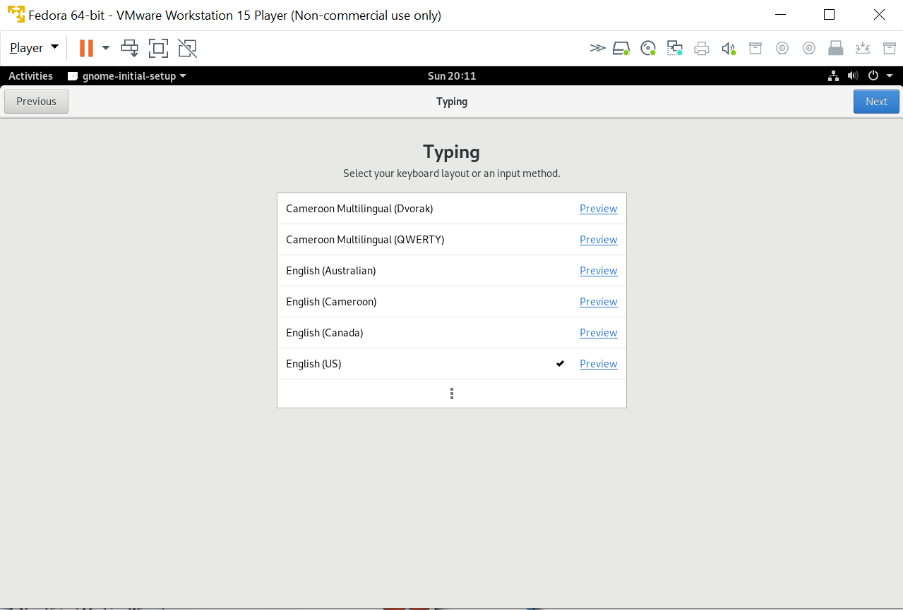
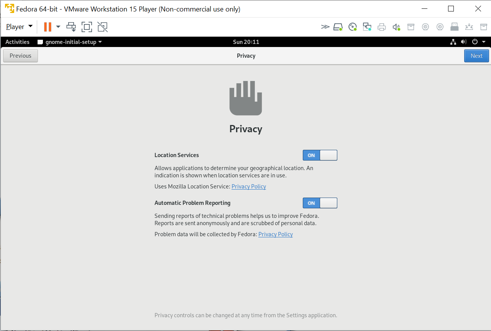

Installing Fedora using VMWare Player
=====================================

Windows 10
~~~~~~~~~~
..
   Created: Fri, March 8, 2019
   Author: Clint Savage <herlo@socallinuxexpo.org>

This document covers how to install VMWare Player on Windows 10, which in turn, is used to install Fedora as a virtual machine.

Downloading VMWare Workstation Player
~~~~~~~~~~~~~~~~~~~~~~~~~~~~~~~~~~~~~

Download the VMWare Workstation Player at

http://www.vmware.com/products/workstation-player/workstation-player-evaluation.html

Installing VMWare
~~~~~~~~~~~~~~~~~

Locate and double-click on the downloaded file. It should launch the installer.

follow the prompts as given below:

Restart
-------

After the last step (above), the computer will need to be restarted.

Launch VMWare
~~~~~~~~~~~~~

Upon reboot, there should be an icon on the desktop labeled 'VMWare Worksation Player 15' (or similar). Double-click the icon to start VMWare.

.. image:: 10-run-vmware.png
   :scale: 75 %

Create a New Virtual Machine (VM)
~~~~~~~~~~~~~~~~~~~~~~~~~~~~~~~~~

The VMWare Workstation 15 Player main screen should be displayed.

Click 'Create a New Virtual Machine'

Select the Fedora installation ISO.

.. note:: Use `Fedora-Workstation-netinst-x86_64-29-1.2.iso` from the provided labeled `ISOS` or `ISOS NTFS`.

.. todo:: Missing step 13

Choose `Linux` for the Guest Operating System

Give the VM a Name. Use 'Fedora' or similar.

Create a 20GB virtual disk for the operating system.

.. note:: Use 'Store virtual disk as a single file'

Click 'Finish' to create the VM.

Once the VM is created, it will be listed on the main screen

Start the Virtual Machine (VM)
~~~~~~~~~~~~~~~~~~~~~~~~~~~~~~

Ensure the proper VM is selected, and choose `Play Virtual Machine`. If everything worked, the machine should begin to boot.

Once the `vmware` boot screen comes up, the installer should start.

.. image:: 21-vmware-starting-installer.png
   :scale: 85 %

From the GUI installer menu, select the language options you prefer. Choose `Continue` when ready.

After a short while, the Installation Source and Software Selection should be downloaded. 

.. image:: 23-vmware-install-summary.png
   :scale: 85 %

.. note:: This is a network based install, so it may take a moment longer than expected.

Choose `Installation Destination` and ensure the 20GB disk `VMWare Virtual` disk is selected.

.. image:: 24-vmware-install-disk.png
   :scale: 85 %

Once all of the items are resolved, click `Begin Installation`.

As the installation progresses, one can set the root password, and create a user.

Selecting `User Creation` will allow you to create an unprivileged user.

.. image:: 27-vmware-install-create-user.png
   :scale: 85 %

.. note:: _________________ / ___________________

          Write down the username and password for this user.
          It is useful to select `Make this user and administrator`.

Selecting `Root Password` will allow you to set the root user's password.

.. image:: 28-vmware-install-root-pw.png
   :scale: 85 %

.. note:: The 'root' user is the administrator user on Linux systems.

When the installation has completed, the `Reboot` button will appear blue. Click to reboot into the new operating system you've just installed!

.. image:: 29-vmware-install-reboot.png
   :scale: 85 %

Booting into Fedora
~~~~~~~~~~~~~~~~~~~

After rebooting, the VM should come up and boot directly into Fedora.

.. image:: 31-vmware-f29-logo.png
   :scale: 85 %

The user created during installation should appear on the login screen. 

Select the user and enter the password you recorded above.

.. image:: 33-vmware-f29-password.png
   :scale: 85 %

Upon successful login, a welcome screen appears.

.. image:: 34-vmware-f29-bienvenue.png
   :scale: 85 %

There are a few setup pages.

There are a series of helpful starting pages. Review them at your leisure.

Welcome to Fedora, click 'Activities' in the top right corner to get started.

.. image:: 40-vmware-f29-desktop.png
   :scale: 85 %

